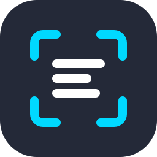

<div align="center">


<br>


<br>

</div>


## `01` ▸ CONTATO

Aberto a novas oportunidades, projetos e colaborações. Fique à vontade para chamar:

<a href="mailto:pedroferreira5711@gmail.com"></a>
<a href="https://linkedin.com/in/pedro-moraes-31526233a/"></a>
<a href="https://github.com/PedroMoraes57"></a>


## `02` ▸ SOBRE MIM

```yaml
desenvolvedor:
  nome:      "Pedro Henrique Ferreira Moraes"
  funcao:    "Full-Stack Developer"
  local:     "Brasil"
  foco:      ["Back-end ", "Front-end", "Interfaces modernas"]
  filosofia: "Código organizado, funcional e escalável"
  status:    "Aberto a novos desafios"
```

> Desenvolvedor apaixonado por tecnologia, atuando tanto no **frontend** quanto no **backend**. Combino desenvolvimento web moderno com soluções de **Inteligência Artificial**, criando aplicações que fazem a diferença.

- ⚡ Atualmente desenvolvendo o **Signalive** — plataforma de tradução de Libras em tempo real com IA
- 🧠 Trabalhando com **PHP, PostgreSQL, React e Bootstrap** no dia a dia profissional
- 🚀 Sempre buscando evoluir e aprender novas tecnologias


## `03` ▸ FORMAÇÃO

<table width="100%">
  <tr>
    <td width="60%"><b>Análise e Desenvolvimento de Sistemas</b><br><sub>SENAI</sub></td>
    <td align="right"></td>
  </tr>
  <tr>
    <td><b>Java Fundamentals — Oracle</b><br><sub>SENAI</sub></td>
    <td align="right"></td>
  </tr>
  <tr>
    <td><b>Ciência da Computação</b><br><sub>UNIP</sub></td>
    <td align="right"></td>
  </tr>
</table>


## `04` ▸ STACK TECNOLÓGICA

#### ◤ FRONTEND ◢


#### ◤ BACKEND ◢


#### ◤ BANCO DE DADOS ◢


#### ◤ IA & DADOS ◢





## `05` ▸ FERRAMENTAS


#### ◤ ESTUDANDO ATUALMENTE ◢


## `06` ▸ PROJETOS EM DESTAQUE

<table width="100%">
<tr>
<td width="50%" valign="top">

### 🤟 SIGNALIVE


Plataforma web com **Inteligência Artificial** capaz de realizar tradução de **Libras em tempo real**, promovendo acessibilidade e comunicação inclusiva através da tecnologia.

`Python` `Django` `React` `TypeScript` `Tailwind` `Computer Vision`

</td>
<td width="50%" valign="top">

### 🍃 REUSE AI


Aplicação web com **IA** para detectar e orientar o descarte correto de objetos, contribuindo para um futuro mais sustentável.

`Python` `Django` `React` `TypeScript` `Tailwind` `SQLite`

<a href="https://github.com/PedroMoraes57/Reuse-Ai"></a>

</td>
</tr>
<tr>
<td width="50%" valign="top">

### 📄 D.O.C


Sistema web em Django para **digitalização, organização e classificação de documentos** com OCR e Inteligência Artificial, integrando NLP e a Gemini API.

`Python` `Django` `MySQL` `JavaScript` `Gemini API` `OCR` `NLP`

<a href="https://github.com/PedroMoraes57/D.O.C---Digitaliza-o-Classifica-o-e-Organiza-o-"></a>

</td>
<td width="50%" valign="top">

### 🌍 CONECTANDO O MUNDO


Aplicação web integrando a **API Countries** para buscar informações detalhadas sobre todos os países do mundo.

`Python` `Django` `SQLite` `JavaScript` `REST API`

<a href="https://github.com/PedroMoraes57/Integra-o-API-Paises-e-API-REST"></a>

</td>
</tr>
<tr>
<td width="50%" valign="top">

### 📱 SENAI AGILE


**Progressive Web App** desenvolvido com Django, com suporte offline e experiência nativa de aplicativo diretamente no navegador.

`Python` `Django` `SQLite` `JavaScript` `PWA`

<a href="https://github.com/PedroMoraes57/SENAI-AGILE"></a>

</td>
<td width="50%" valign="top">

### 🏭 CRUD DE MÁQUINAS


Aplicação web para **gerenciamento de colaboradores e máquinas** vinculadas, com interface limpa e funcional.

`Python` `Django` `SQLite`

<a href="https://github.com/PedroMoraes57/DJMaquinas"></a>

</td>
</tr>
</table>


## `07` ▸ GITHUB ANALYTICS

<div align="center">


</div>


## `08` ▸ CONTRIBUTION SNAKE

<div align="center">


</div>

<div align="center">


</div>
